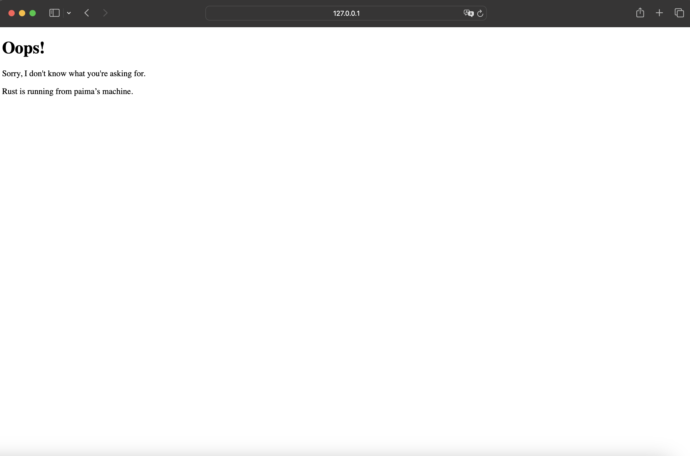

# Commit 1 Reflection Notes
Fungsi handle_connection menerima satu parameter yaitu sebuah koneksi TCP yang akan diproses. BufReafer membaca data dari TcpStream. Lines() mengembalika iterator yang membaca baris dari buffer. map(|result| result.unwrap()) mengambil nilai dari Result<String>. take_while(|line| !line.is_empty()) membaca baris sebelum baris kosong. collect() mengubah iterator menjadi vector. println!("Request: {:#?}", http_request); mencetak vektor HTTP request. Jadi fungsi handle_connection berguna untuk membaca permintaa HTTP dari klien, menyimpan bagian header HTTP, dan mencetak hasilnya ke terminal.

# Commit 2 Reflection Notes
let status_line = "HTTP/1.1 200 OK"; menentukan status HTTP Response. let contents = fs::read_to_string("hello.html").unwrap(); membaca isi file hello.html sebagai string. let length = contents.len(); menghitung panjang konten. let response = format!("{status_line}\r\nContent-Length: {length}\r\n\r\n{contents}"); membuat response HTTP. stream.write_all(response.as_bytes()).unwrap(); mengirimkan response ke klien. Jad, fungsi handle_connection yang baru dapat menambahkan HTTP response setelah membaca request, membaca file hello.html, dan mengirim response lengkap ke klien melalui TcpStream. 

# Commit 3 Reflection Notes
Jika request line adalah "GET / HTTP/1.1" maka akan membaca hello.html selain dari itu maka akar membaca 404.html.

Refactoring diperlukan untuk meningkatkan maintainability, jika kita ingin mengganti response, kita tidak perlu untuk menggantinya 2 kali (pada blok if dan else).

# Commit 4 Reflection Notes
Browser membutuhkan waktu untuk load karena server hanya menggunakan satu thread untuk menangani semua koneksi. Saat ada request ke /sleep, program tidak bisa menangani permintaan lain sampai thread::sleep(Duration::from_secs(5)) selesai.

